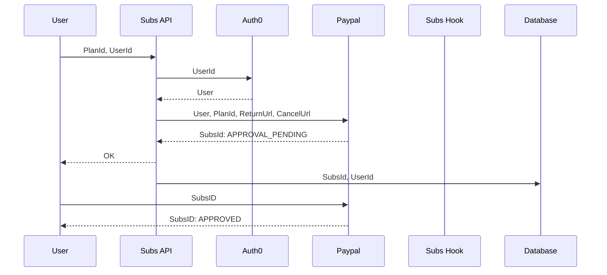

# input

## Subscription flow

```mermaid
sequenceDiagram
    participant U as User
    participant S as Subs API
    participant A as Auth0
    participant P as Paypal
    participant H as Subs Hook
    participant D as Database

    U->>S: PlanId, UserId
    S->>A: UserId
    A-->>S: User
    S->>P: User, PlanId, ReturnUrl, CancelUrl
    P-->>S: SubsId: APPROVAL_PENDING
    S-->>U: OK
    S->>D: SubsId, UserId
    U->>P: SubsID
    P-->>U: SubsID: APPROVED
```
